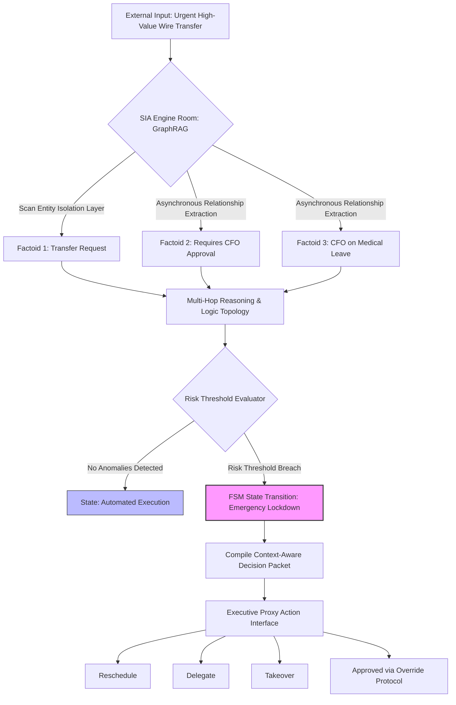

# AI PoC Portfolio

Welcome to the AI Proof of Concept (PoC) repository, featuring high-level AI orchestration, data security frameworks, and sovereign infrastructure design, with interactive testing via Google Colab.

---

## Available Proof of Concepts

### 🚀 PoC 1: Mind Filter (SimPoC)

**Description:** A human-centric cognitive optimization tool that converts unstructured data and chaotic operations into structured, executive-ready thought matrices.

### 🛡️ PoC 2: Resource Entropy & Orchestration Sandbox

**Description:** An executive-ready governance sandbox demonstrating how Sovereign Infrastructure Architecture (SIA) mitigates systemic corporate risk. It replaces unsafe probabilistic AI actions with an immutable, deterministic framework designed to detect and intercept advanced operational threats.

#### Enterprise Stress Test: Intercepting the CFO Phishing Scam
Traditional linear AI bots or centralized legacy applications operate on rigid scripts or simple data retrieval, making them highly vulnerable to social engineering (e.g., executing an urgent, high-value transfer request from a compromised account while the CFO is out). 

This sandbox utilizes a non-intrusive middleware layer and a multidimensional logic topology to enforce total corporate safety through two distinct governance mechanisms:
*   **Multi-Hop Reasoning via GraphRAG:** The architecture cross-references real-time operational streams against scattered corporate facts without altering the primary legacy storage tables. It instantly links distinct micro-facts: `[Transfer Request]` $\rightarrow$ Requires `[CFO Approval]` $\rightarrow$ Cross-Referenced against `[CFO is on Leave]`.
*   **Deterministic Governance via Finite State Machines (FSM):** Upon detecting a breach of risk thresholds, the system instantly triggers an automated state transition. It overrides standard probabilistic execution, moves into emergency lockdown, and compiles an audited, zero-friction **Decision Packet** for authorized executive proxies (offering direct actions: *Reschedule*, *Delegate*, *Takeover*, or *Approve with Override Protocol*).

---

## Deterministic Governance Architecture

The workflow below illustrates the network-wide verification and FSM state containment sequence during a critical risk event:

## How to Run

1. Click the **Open in Colab** button above.
2. Select **Runtime** > **Run all** in the menu.
3. Interact with the web interface at the bottom.

*Note: The environment may timeout after inactivity; simply re-run the cells if necessary.*

# AI PoC Portfolio

Welcome to the AI Proof of Concept (PoC) repository, featuring high-level AI orchestration, data security frameworks, and sovereign infrastructure design, with interactive testing via Google Colab.

---

## Available Proof of Concepts

### 🚀 PoC 1: Mind Filter (SimPoC)

> [!WARNING]
> 

**Description:** A human-centric cognitive optimization tool that converts unstructured data and chaotic operations into structured, executive-ready thought matrices.

### 🛡️ PoC 2: Resource Entropy & Orchestration Sandbox

> [!WARNING]
> 

**Description:** An executive-ready governance sandbox demonstrating how Sovereign Infrastructure Architecture (SIA) mitigates systemic corporate risk via deterministic state containment.

---

## Deterministic Governance Architecture

The workflow below illustrates the network-wide verification and FSM state containment sequence during a critical risk event:

This document was structured with the help of AI, and curated by MSK

