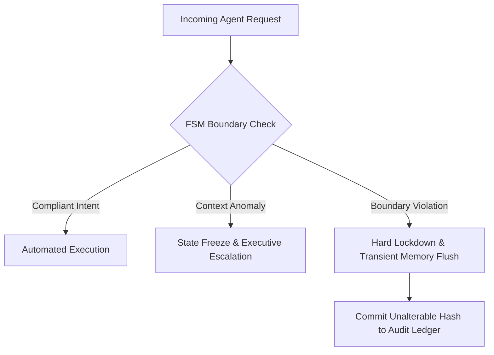

# AI PoC Portfolio

Welcome to the AI Proof of Concept (PoC) repository, featuring high-level AI orchestration, data security frameworks, and sovereign infrastructure design, with interactive testing via Google Colab.

---

## Available Proof of Concepts

### 🚀 PoC 1: Mind Filter (SimPoC)

> [!WARNING]
> 

**Description:** A human-centric cognitive optimization tool that converts unstructured data and chaotic operations into structured, executive-ready thought matrices.

### 🛡️ PoC 2: Resource Entropy & Orchestration Sandbox

> [!WARNING]
> 

**Description:** An executive-ready governance sandbox demonstrating how Sovereign Infrastructure Architecture (SIA) mitigates systemic corporate risk via deterministic state containment.

---

## How to Run

1. Click the **Open in Colab** button above.
2. Select **Runtime** > **Run all** in the menu.
3. Interact with the web interface at the bottom.

*Note: The environment may timeout after inactivity; simply re-run the cells if necessary.*

This document was structured with the help of AI, and curated by Sana.M.

# SIA Sovereign Execution Suite & Interactive PoC Sandbox

> **Executable Verification Layer for the [Sovereign Infrastructure Architecture (SIA)](https://github.com/26200602/SIA-Agentic-AI-Architecture)**

This repository provides an executive-ready, interactive simulation environment built to demonstrate deterministic enterprise AI governance, zero-trust boundary enforcement, and human-centric cognitive structuring.

For the underlying architecture thesis and ISO 42001 / GDPR compliance framework, refer to the [Intent-Driven FSM Governance Whitepaper](https://github.com/26200602/SIA-Agentic-AI-Architecture/blob/main/docs/intent-driven-fsm-governance.md).

---

## Interactive Proof of Concept (PoC) Modules

### 🛡️ PoC 1: Resource Entropy & FSM Boundary Governance Sandbox

**Core Objective:** Demonstrates how SIA's Finite State Machine (FSM) boundary isolates probabilistic AI models (LLMs/SLMs) to enforce zero-knowledge data retention and zero-touch operational containment.

**Simulated Operational Scenarios:**

1. **Automated Baseline Enforcement**: Evaluates routine transactional intent against pre-parsed policy constraint rules, executing compliant actions automatically without human overhead.
2. **Context-Aware Interception**: Detects organizational anomalies (e.g., unauthorized high-value transfer while authorizing CFO is marked on leave) and freezes state transitions prior to database commit.
3. **Exfiltration Containment & Session Shredding**: Simulates an out-of-bounds data extraction attempt by an untrusted agent. The FSM triggers an immediate lockdown, terminates the session, and cryptographically flushes transient memory.

### 🚀 PoC 2: Mind Filter Matrix (Cognitive Structuring Engine)

**Core Objective:** A human-centric cognitive optimization tool engineered to transform unstructured data, raw operational logs, and complex strategic thought into decision-ready executive matrices.

**Key Architectural Features:**
* **Factoid Extraction**: Converts dense textual input into decoupled, atomic data units.
* **Semantic Matrix Mapping**: Eliminates operational noise to accelerate C-suite evaluation and strategy formulation.

---

## Execution Instructions

1. Click the **Open in Colab** badge for the corresponding PoC module above.
2. Navigate to **Runtime** > **Run all** in the Google Colab interface.
3. Scroll down to interact with the web interface rendered at the bottom of the notebook.

*Note: Environments execute within isolated cloud runtimes. Inactivity may reset the session state; re-run cells as necessary.*

---

## Global Visibility Index

### Topics & Categories
`enterprise-ai` | `ai-governance` | `finite-state-machines` | `proof-of-concept` | `data-sovereignty` | `iso-42001` | `gdpr-compliance` | `agentic-ai` | `risk-mitigation` | `zero-trust`

---

*This document was structured with the help of AI, and curated by MSK*

